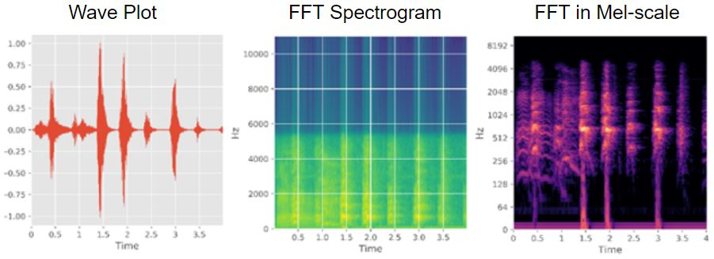
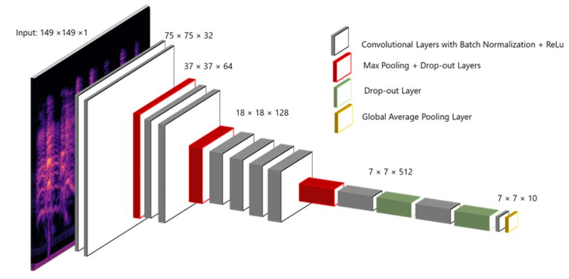

# Previsor de Choro

**Previsor de Choro** é uma aplicação que utiliza **redes neurais convolucionais (CNN)** para prever a razão do choro de um bebé com base numa gravação de áudio em formato mp3. O objetivo é fornecer uma análise rápida e precisa do motivo pelo qual o bebé está a chorar, ajudando pais e cuidadores a responder de forma adequada e rápida às necessidades da criança.

### Funcionamento

1. **Transformada Rápida de Fourier (FFT)**:
   - Após a gravação do choro, a aplicação processa o áudio utilizando uma **Transformada Rápida de Fourier (FFT)** para gerar um espectrograma, que será utilizado para extrair características importantes. 

   

2. **Rede Neural Convolucional (CNN)**:
   - O espectrograma gerado é analisado através de uma **Rede Neural Convolucional (CNN)** pré-treinada, que identifica padrões no áudio que indicam a razão do choro, como fome, cansaço, desconforto, entre outros.
 
   

### Características

Aqui está a tabela com os códigos para cada razão do choro do bebé:

| Código | Razão do Choro      |
|--------|---------------------|
| bp     | Dor de barriga       |
| bu     | Necessidade de arrotar|
| ch     | Temperatura          |
| dc     | Desconforto          |
| hu     | Fome                 |
| lo     | Solidão              |
| sc     | Assustado            |
| ti     | Cansado              |

### Tecnologias Utilizadas

- **B4XPages (B4A)**: Utilizado para desenvolver a interface do utilizador na aplicação Android.
- **TensorFlow**: Framework de machine learning utilizado para implementar a rede neural convolucional (CNN) para a previsão do choro.
- **Python**: Linguagem de programação usada para processamento de áudio e treino do modelo de machine learning.
